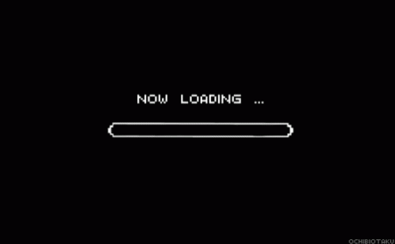

# TheSharkProject


Un ejecicio de mejora de manejo de pandas y de herramientas de visualizacion 

## Comenzando 🚀

_Estas instrucciones te permitirán obtener una copia del proyecto en funcionamiento en tu máquina local para propósitos de desarrollo y pruebas._

Mira **Deployment** para conocer como desplegar el proyecto.


### Pre-requisitos 📋

pip y conda son vuestros amigos, necesitareis alguna que otra libreria.

```
import pandas as pd
import numpy as np
import sys
from os import path
import matplotlib.pyplot as plt
import seaborn as sns
import plotly.express as px
from PIL import Image
from wordcloud import WordCloud, STOPWORDS, ImageColorGenerator
import re
import missingno as msno
```


## Objetivo de limpieza y manipulacion de datos con pandas 📦

Creacion de funciones de limpieza y manipulacion. Gestion visual del proceso gracias a la libreria missingno.


## Hipotesis en base a los datos para visualizar 🖇️

### 1. La juventud es carne.
### 2. Evolcion temporal de los encuentros por invasion de persona en el medio, mirada especial a las mujeres.
### 3. La fama del tiburon blanco.


## Versionado 📌

En porceso continuo de mejora

## Autores ✒️


* **Fernando Zapico** - *Trabajo Inicial* - [4tolon](https://github.com/4tolon)


## Licencia 📄

Para dar y regalar.

## Expresiones de Gratitud 🎁

* A mi familia, Ana, Olivia, Maya y Nora. Sin vosotras no soy nada 📢
* Ana 🍺 Sonia ☕ me queda mucho que pulir, lo comentamos de palabra, no me hagais eso analisis excritos tan preciosos, que lo mio no esta a vuestra altura. 
* Gracias a todos los que sepan perdornar que no haya ni una tilde en este Readme. Las pondre en primavera.
* Ras 🤓, cree una funcion con tu nombre en src.... funciono dos veces bien y luegos resulto ser un....

... todo el finde perdido en el mentauniverso ...


